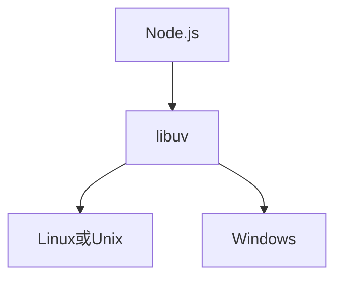

# Node篇---（一）特点

<!-- more -->

*Mission Start!*

## 1、异步I/O
异步在前端JavaScript是很常见的，例如使用JQuery发起ajax请求：

```js
$.ajax({
  url: '/url',
  data: {},
  type: post,
  dataType: json,
  success: function (data) {
    console.log('数据请求成功：', data);
  }
});
```

异步I/O相对于同步I/O来说，其优势在于可以大大缩短多个I/O需要的时间，例如：

```js
let fs = require('fs');

fs.readFile('./file1', function (error, file) {
  console.log('file1读取完成');
});
fs.readFile('./file2', funciton (error, file) {
  console.log('file2读取完成');
});
// 这段脚本的耗时取决于两个文件之间读取耗时最多的那个
// 而在同步I/O中，相同功能的脚本耗时为两个文件读取耗时之和
```
由此可见异步I/O的优势是很大的。

## 2、单线程
Node是单线程的，不用像多线程编程一样在意状态的同步问题，也无法像多线程一样利用多核的CPU。   
   
另外的问题在于，大量计算占用CPU将导致无法继续调用异步I/O。在Node中的解决方案是通过使用Master-Worker模型，将大量计算拆分为小量的计算，并分发给工作线程进行处理。

## 3、跨平台
Node在操作系统之上搭建了一层平台层---libuv，其与不同的操作系统进行交互，向上层的Node模块提供统一的接口，如图：



## 4、C/C++扩展
在Node中，可以像PHP一样，通过C/C++编写Node扩展，来提高性能。

*Mission Complete!*