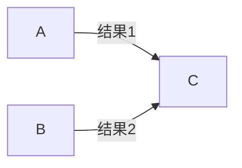
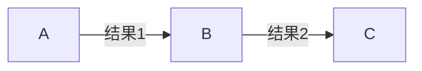

# Node篇---（三）异步编程的问题

*Mission Start!*

异步编程很好用，但在很多时候也会因为与我们的思维方式不一致而产生一些问题。

## 1、异常处理的捕获
在介绍这个之前，我们需要了解Node的时间循环机制：

> 循环机制：Node进程在启动时会创建一个循环，每次循环都会检查是否有待处理事件，若存在就执行相对应的回调函数。每一次循环称为一个**Tick**。

OK，进入主题。   
在PHP或者Java中，我们常会用try、catch、finally等来捕获异常，因此，我么很有可能会写出以下的代码：

```js
try {
  someFunction(function(){
    // 回调函数的具体实现
  });
} catch (e) {
  console.log(e.getMessage());
  // ...
}
```
但实际上，在调用someFunction()方法后，回调函数会被保存起来，直至下一个Tick才会被执行，而try/catch只能捕获当前Tick内的异常。   

#### 解决方案 
Node约定将异常作为回调函数的第一个参数传回，如：

```js
someFunction(function (error, result) {
  if (error) {
    // 出现异常
  } else {
    // 正常执行
  }
});
```
如果存在异常，error为具体的异常；如果正常执行，没有异常，error则为null。

## 2、不能阻塞代码
在JavaScript中，没有提供sleep()线程沉睡功能的函数，只有setInterval()和setTimeout()这两个延时执行的函数，且不会阻塞后续代码的执行。   

#### 解决方案
当需要用到阻塞时，考虑用setTimeout去实现😂。

## 3、多线程编程
Node属于单线程的编程语言，一个Node进程不能充分利用多核CPU的资源，而复杂的业务逻辑往往要求需要很好的利用多核CPU以提供更多的计算服务。

#### 解决方案
当需要充分利用多核CPU时，可以参考Web Worker的实现，即Mater-Worker模型，通过Master创建工作线程，使用子线程去计算，以充分利用CPU资源。   

在Node中，我们可以使用Node的child_process的API去进行相关的需求实现。

## 4、}}}}}嵌套问题
### ① 无顺序 ((A、B全部完成)->C)
多个操作存在先后依赖关系，执行C需要A、B过程的结果（虽然A、B之间并不存在依赖关系，但C的执行A、B的结果缺一不可）。如图：


在同步编程中，我们是这样做的（PHP）：

```php
$result1 = A();
$result2 = B();
$result = C($result1, $result2);
```
但是在JavaScript中是使用异步编程的，通过回调函数来执行后续操作，而且A、B、C三个回调函数的执行并不存在顺序关系，例如：

```js
A(callbackA);
B(callbackB);
C(callbackC);
```
上述代码中，callbackA、callbackB、callbackC的执行顺序是不固定的，我们不能保证C在A、B之后执行。   
那如何实现这个需求呢？   
我们可以使用函数嵌套将整个执行过程串行化，将上面的代码调整下：

```js
A(function (result1) {
  B(function (result2) {
    C(function (result) {
      // ...
    });
  });
});
```
这样确实可以实现目标需求，但却出现了}}}}}嵌套问题，也称为恶魔金字塔，过多的嵌套让代码显得很难看，不优雅。而且，上述整个过程的执行时间为：
> A的耗时 + B的耗时 + C的耗时。

#### 解决方案1
如何更好地处理这个呢？使用变量进行计数：

```js
var count = 0;
var results = {};
var done = function (key, value) {
  results[key] = value;
  count++;
  if (count === 2) { // A, B两次
    C(results);
  }
}

// 在A、B的回调函数中调用done
A(function (data) {
  done('A', data);
});
B(function (data) {
  done('B', data);
});
```
这样就可以避免使用嵌套，同时还能降低耗时，上述代码的总执行时间为：
> max(A的耗时, B的耗时) + C的耗时。

##### 优化
上述代码还可以用偏函数、事件发布/订阅模式进行优化。
> **偏函数**：用于生成已预置参数或变量的函数的函数，首先它是一个函数，其作用是生成参数或变量已预置的函数。例如：
> 
> ```js
> var add = function (a, b) {
>   return a + b;
> }
> var add_1 = function (num) { // 将add()函数的参数预置为1，得到加1函数
>   return add(num, 1);
> }
> var sub_1 = function (num) { // 将add()函数的参数预置为-1，得到减1函数
>   return add(num, -1);
> }
> ```
> **事件发布/订阅模式**：在JavaScript中很常见，对应的就是触发事件/监听事件，在Node中的具体实现：
> 
> ```js
> // 订阅
> emitter.on("eventName", function (param1, param2) {
>   console.log(param1, param2);
>   // console.log(arguments); // arguments为传入的参数数组
> });
> // 发布
> emitter.emit("eventName", "This is param1", "This is param2");
> ```
> *PHP中获取参数：function test(...$args) {}或使用函数func_get_args、func_get_arg、func_num_args*

优化后的代码：

```js
// 偏函数
var after = function (times, callback) {
  var count = 0;
  var results = {};
  return function (key, value) {
    results[key] = value;
    count++;
    if (count === times) {
       callback(results);
    }
  }
}

var done = after(2, C);
emitter.on("done", done);  // 添加监听事件

A(function (data) {
  emitter.emit("done", "A", data);  // 触发done事件，并将结果传回
});
B(function (data) {
  emitter.emit("done", "B", data);  // 触发done事件，并将结果传回
});
```
#### 解决方案2
使用EventProxy模块：

```js
const EventProxy = require("eventproxy");
var proxy = new EventProxy();

// 使用all监听event1、event2事件，当两个事件都完成时，调用C回调函数。
proxy.all("event1", "event2", C); 

A(function (result1) {
  // 触发event1事件
  proxy.emit("event1", "This is event1 argument", result1);
});
B(function (result2) {
  // 触发event2事件
  proxy.emit("event2", "This is event2 argument", result2);
});
```
EventProxy在每一次触发非all事件时，都会触发一次all事件。
#### 解决方案3
使用Promise（后续介绍）


### ② 有顺序（A->B->C）
C依赖于B，B依赖于A

这种情况也能通过函数嵌套来将整个过程串行化，从而实现该需求，时间消耗为：
> A的耗时 + B的耗时 + C的耗时

#### 解决方案
因为这种情况存在先后依赖关系，所以耗时不能进行优化，只能优化代码的函数嵌套问题。   
同样可以使用Promise进行优化（后续介绍）

*Mission Complete!*