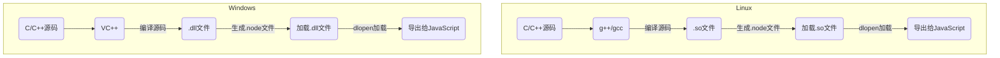

# Node篇---（二）模块

*Mission Start!*

随着前端功能的增多，JavaScript的文件数量和复杂度也不断提升，使用script标签引入js代码显得无力、混乱，而在其他高级语言中都有类似模块的概念（PHP有include、require，Java有包、类文件）。

## 1、JavaScript的模块规范

JavaScript在强大的社区力量下，也出现了很多模块规范：CommonJS、AMD、ES6 Module等。

### AMD
特点：异步加载   
具体实现：requireJS   
模块定义：

```js
// test1.js
define(function () {
  return {
    name: 'Alan',
    age: 18
  };
});
```

模块引用：

```js
// test2.js
require(['./test1.js'], function (moduleName) {
  console.log(moduleName.name);
});
```
### ES6 Module
特点：按需加载（编译时加载）   
具体实现：ES6最新语法   
模块定义：

```js
// a.js
export function test1() {
  console.log("This is function test1");
}
export function test2() {
  console.log("This is function test2");
}
export default function test3() {
  console.log("This is default function test3");
}
// export default表示默认导出，在import引用时可以指定任意名称
```

模块引用：

```js
import {test1, test2} from './a';

test1();
test2();
```
或

```js
// 导入默认模块（可为模块指定任意名称）
import test from './a';

test();  // 输出This is default function test3
```

> 注意事项：
> 
> ① import具有提升效果，会提升到整个模块的头部，因为import是在编译阶段执行；
> 
> ② export命令规定的是对外的接口，必须与模块内部的变量建立一一对应关系。
> 
> 例如：
> 
> ```js
> var name = 'Alan';
> // export name; // 错误
> // export 'Alan'; // 错误
> export {name};  // 正确
> 
> export var name = 'Alan'; // 正确
> 
> function test() {
>   console.log("This is test");
> }
> 
> // export test; // 错误
> export {test}; // 正确
> 
> export function test() {} // 正确
> ```

### CommonJS
特点：   
① 模块在第一次加载时运行一次，然后将结果放到缓存中，以后加载直接读取缓存结果。   
② 同步加载。   
具体实现：NodeJS   
模块定义：

```js
// a.js
exports.test1 = function () {
  console.log('This is function test1');
}
module.exports.test2 = function () {
  console.log("This is function test2");
}
// module.exports与exports等效
// exports只是module.exports的一个引用
// Node为每个模块都提供一个变量exports，指向module.exports
// 可以理解为在每个模块的头部隐藏了一行代码：var exports = module.exports;
```
模块引用：

```js
var moduleName = require('./a'); // 模块使用小驼峰命名规则，可不加文件后缀.js
moduleName.test();
```

## 2、Node的模块实现

Node模块是参照CommonJS规范实现的，并对其进行了一定的取舍，并不是完全按照其规范实现的。   
在Node中引入模块的过程分为三个阶段：
> ① 路径分析：核心模块、相对路径文件模块、绝对路径文件模块、非路径形式的文件模块
> 
> （当前目录下的node_module、父目录下的node_module、父目录的父目录下的node_module...）
> 
> ② 文件定位：当模块标识符不包含文件扩展名时，Node会按.js、.json、.node的次序补全，依次尝试
> 
> （如果是.node或.json文件，带上扩展名性能会更好）
> 
> ③ 编译执行
> 
> 注意：Node的核心模块已被编译为二进制文件，因此文件定位和编译执行省略，而文件模块（用户编写的模块）则需要经历全部过程。

## 3、C/C++模块
C/C++模块在不同平台的编译和加载过程：




<span style="color:red;">注意：Linux和Windows下的.node文件不一样。实际上，在Windows上，它是.dll文件，在Linux上是.so文件。</span>

## 4、NPM
NPM(Node Package Manager)，Node包管理器，类似于PHP中的composer，可以让用户快速安装和管理依赖包。

### 安装依赖包

```sh
npm install PackageName # 如: npm install express
```
该命令会在当前目录下创建node_module文件夹，然后在node_module下创建相应的包目录（如：安装express时创建express文件夹），最后将包解压到这个包目录下。使用时用require('PackageName')即可引入该包。

<span style="color:red;">注意：-g全局安装是指将一个包安装为全局可用的可执行命令，如：npm install es-checker -g安装完成后可以使用es-checker命令检测本地Node对es6的支持程度</span>

### 从非官方源安装

```sh
# 从非官方源安装包
npm install PackageName --registry=http://registry.url
# 设置默认源
npm config set registry http://registry.url
```

*Mission Complete!*
