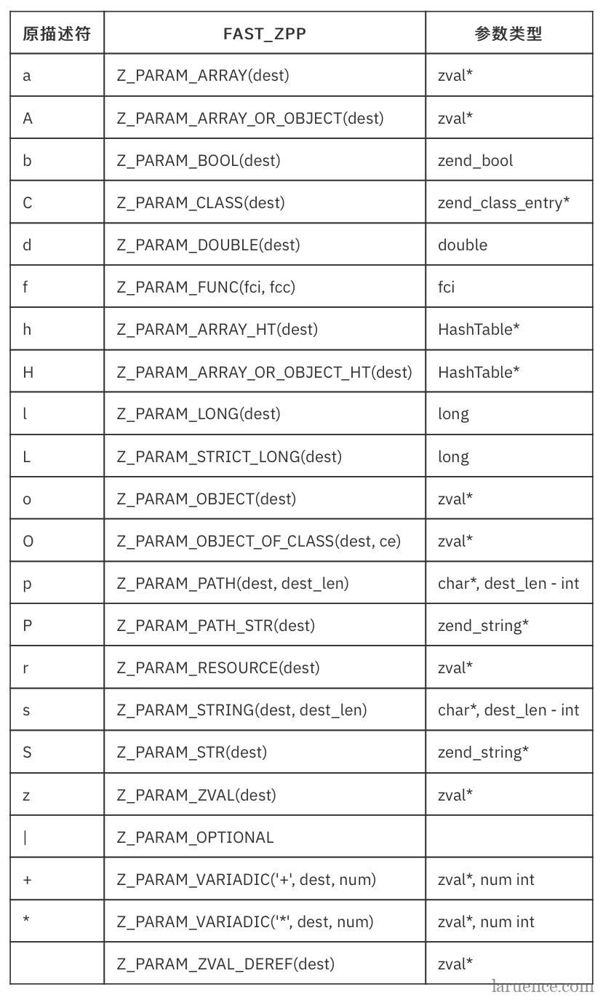

# PHP扩展开发中常用的函数

## PHP函数相关

```c

zend_parse_parameters()     // 解析函数参数
// 例如，s表示字符串, 解析一个字符串类型的参数到name, 及其长度到name_len: 
if (zend_parse_parameters(ZEND_NUM_ARGS() TSRMLS_CC, "s", &name, &name_len) == FAILURE) {
    RETURN_NULL();
}

/* 解析参数时的类型代码 */
b: 布尔类型（对应c类型: zend_bool）
l: 整型（long）
d: 浮点型（double）
s: 字符串（char*, int）
r: 资源型（zval*）
a: 数组（zval*）
o: 对象（zval*）
z: zval（zval*）
```

> 附：PHP 7中使用FAST_ZPP方式解析函数参数的宏：
  
  
  

## 数组操作

```c
array_init(arr)                         // 初始化数组
add_next_index_null(zval*)              // 向数字索引的数组增加null
add_next_index_long(zval*, long)        // ...添加long类型
add_next_index_bool(zval*, 0|1)         // ...添加bool类型
add_next_index_double(zval*, double)  
add_next_index_string(zval*, char*, zend_bool)
add_next_index_zval(zval*, zval*)
// ...
```
更多操作数组的函数: <https://www.php.net/manual/en/internals2.variables.arrays.php>

> 未完待续...