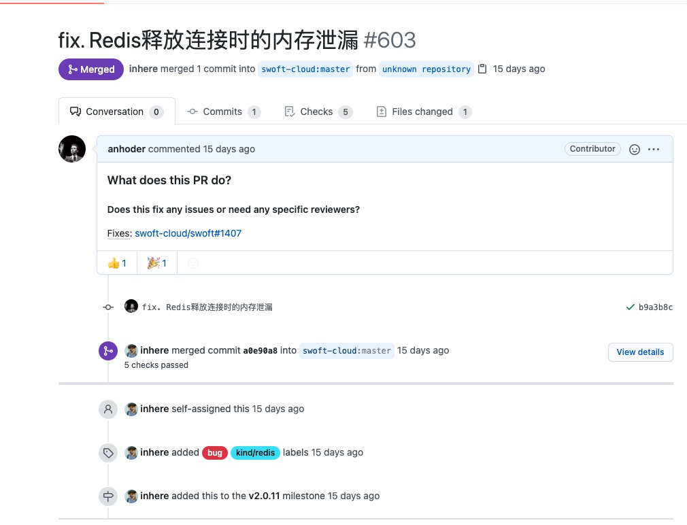
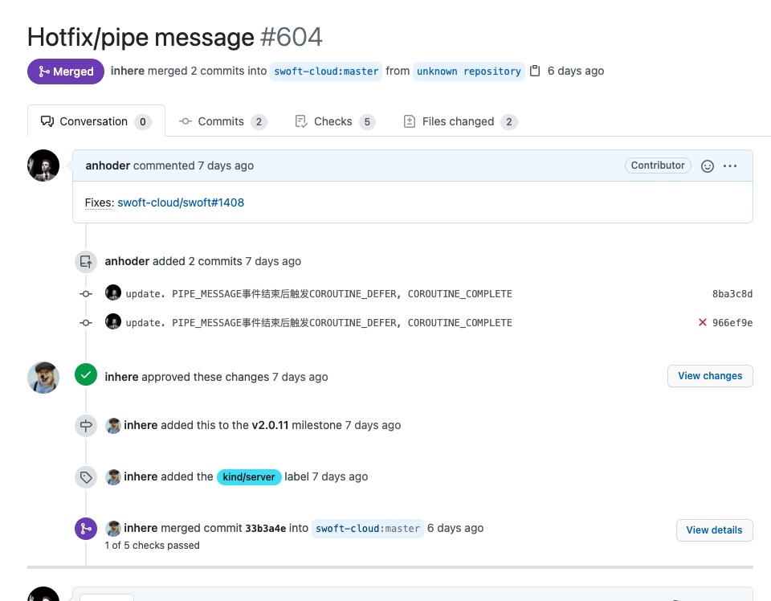

# Swoft内存泄漏排查

最近在公司使用swoft写了一个定时爬取数据的项目，上线后跟踪线上日志发现swoft的worker进程会**出现周期性的内存溢出**：

```txt
Fatal error: Uncaught ErrorException: Allowed memory size of 268435456 bytes exhausted (tried to allocate 262144 bytes)
```

## 一、分析

观察到线上worker进程的内存占用是随时间增长而逐渐上升的，所以排除单次执行导致内存溢出的情况，基本可以确定是项目中的某处代码**存在内存泄漏**。

因此，解决问题的关键就在于**如何定位到项目中产生内存泄漏的位置**。

## 二、定位内存泄漏

### 1、Swoole Tracker

[Swoole Tracker](https://business.swoole.com/tracker/index)是Swoole官方提供的分析工具，可以用来检测项目中的内存泄漏问题（[使用方法](https://mp.weixin.qq.com/s/oAyToE4aNyU3-_PQ5ii3aw)）。

#### 安装

Swoole Tracker的安装比较简单，因为它本身就是一个php的扩展，而且是已经编译好的，我们只需要将编译好的动态链接库文件(.so)放到php的扩展目录下，然后在php.ini中加上配置即可。

#### 使用

安装完Swoole Tracker扩展后，在相应的代码中加入Swoole Tracker提供的Hook函数，例如：

```php
public function onPipeMessage(Server $server, int $srcWorkerId, $message): void
{
    trackerHookMalloc();
    // ...
}
```

接着启动服务，运行一段时间后，在docker容器内执行`php -r "trackerAnalyzeLeak();"`即可获取到服务运行时的内存申请信息、内存释放信息以及可能存在内存泄漏的位置。

#### 检测结果

[memory_leak.txt](media/16100728525468/memory_leak.txt)
> 文件中含命令行颜色代码，可以在命令行使用`cat memory_leak.txt`查看


以下是检测结果中可能存在内存泄漏的代码位置：

```txt
 The Possible Leak As Malloc Size Keep Growth:
 /var/www/swoft_marketing_engine/vendor/swoft/server/src/Server.php:544 =>  Growth Times : [29];  Growth Size : [181440]
 /var/www/swoft_marketing_engine/vendor/swoft/stdlib/src/Helper/ArrayHelper.php:959 =>  Growth Times : [8];  Growth Size : [2784]
 /var/www/swoft_marketing_engine/vendor/swoft/stdlib/src/Helper/ArrayHelper.php:997 =>  Growth Times : [12];  Growth Size : [17920]
 /var/www/swoft_marketing_engine/vendor/swoft/bean/src/Container.php:413 =>  Growth Times : [24];  Growth Size : [10752]
 /var/www/swoft_marketing_engine/vendor/swoft/db/src/Database.php:252 =>  Growth Times : [24];  Growth Size : [1536]
 /var/www/swoft_marketing_engine/vendor/swoft/db/src/Connection/Connection.php:370 =>  Growth Times : [24];  Growth Size : [4608]
```

根据结果，**发现是Swoft框架本身某个位置存在内存泄漏**。

但是，检测结果中只有产生内存申请时的代码位置，还不能确定具体是什么地方未释放内存。

因此，只能换一种思路。

### 2、Valgrind

尝试另外一款内存泄漏分析神器——valgrind。

使用后发现分析报告中只会出现相关的C/C++代码，无法定位到具体的PHP代码位置，放弃。

### 3、memory_get_usage()

使用几种内存泄漏分析工具都无果后，尝试使用最原始的方式——PHP的内置函数`memory_get_usage()`。

大致思路就是在需要调用的函数上下，加上`memory_get_usage()`函数，例如：

```php
var_dump(memory_get_usage());
test();
var_dump(memory_get_usage());
```

因为，正常情况下，在函数调用完成后，Zend引擎会将对应的函数栈销毁，相应的内存会被释放。

> 在使用时，有一些需要注意的点：
> 1. `memory_get_usage()`支持一个布尔类型的参数`real_usage`，表示是否获取真实内存大小，其中包括未被使用的内存空间。因为PHP引擎在申请内存时，会一次申请一大块内存，用于后续使用，以减少系统调用的次数。所以，在这里**不要将它设置为true**。
> 2. 如果函数中存在循环引用（如：Swoft中ORM的join方法），在函数执行完成后，变量并不会被及时释放，输出内存占用会增加，但是这是正常的。因为当待释放变量达到一定数量或内存达到一定阈值时，PHP的GC才会统一释放掉这些的内存。

#### 检查结果

这种方法虽然费时费力，但效果还算不错。经过一段时间排查，成功定位到了两处内存泄漏：

* 在协程中使用Redis时，Swoft未在协程结束后释放相应的Redis连接信息；
* Swoft在处理pipeMessage事件结束后未触发协程结束事件，导致协程数据（MySQL、Redis连接信息等）未被释放。

## 三、解决方案

既然已经定位到内存泄漏的原因了，解决办法就不难了：

* 协程结束后，手动unset Redis的连接信息；
* 在pipeMessgae事件结束后，手动触发协程结束事件，销毁对应协程产生的数据。

## 四、后续

经过以上处理后，**截至目前，线上swoft项目的内存占用稳定在50M左右，未出现内存溢出错误**。

此外，针对这两个问题，我在GitHub上向Swoft团队提交了两个相应的issue及修复PR，目前代码已被合并到master。





## 五、总结

其实，内存溢出、内存泄漏的情况并不容易发生（单次运行直接爆内存的除外emmm...），只要你：

* 不轻易使用全局变量、静态变量；
* 如果不可避免的需要使用到全局变量、静态变量，一定要在用完后unset掉相应的数据。

> 另外，在排查过程中，用到的一个挺好用的查看内存占用的工具——smem，可以查看程序的USS、PSS、RSS👍。