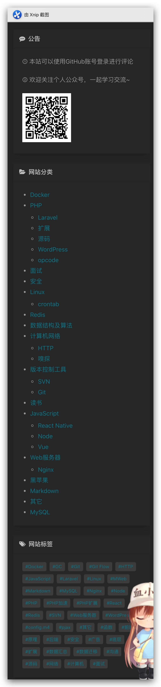
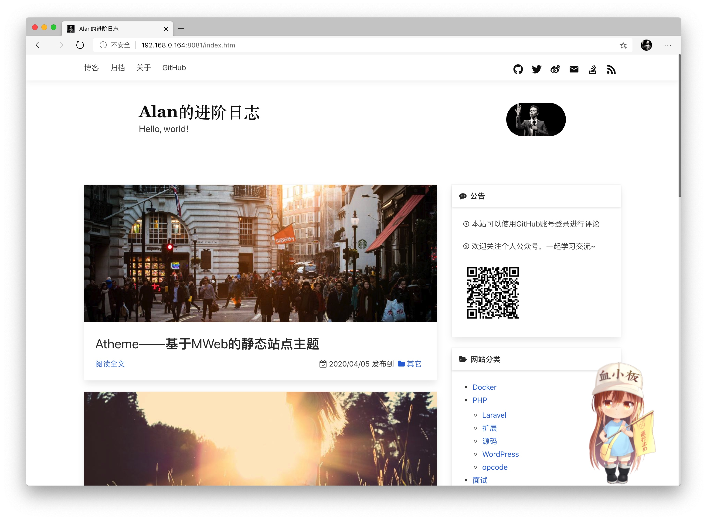

# Atheme——基于MWeb的静态站点主题

最近总觉得我的博客主题有点丑，于是趁着假期优化一下（***调样式真的累，特别是对于强迫症患者。。。😭***）

## MWeb是什么

MWeb是Mac OS上的一个Markdown编辑器，其具备很多功能：

* 发布图片到图床
* 直接发布文章到WordPress、印象笔记、语雀等站点
* Markdown导出为图片、PDF、富文本、HTML等
* 设置页面主题
* 将Markdown编译为静态站点
* ...

总而言之，MWeb是一款很优质的Markdown编辑器，搭配上Github Pages及Gitee Pages，简直不要太爽。

## Atheme主题

本文介绍的Atheme就是一款基于MWeb编辑器的可配置的静态站点主题。它是我在MWeb自带主题——**BulmaCSS**的基础上进行添加、修改、优化而出现的产物。以下主要介绍这个主题的主要功能：

1. 网站菜单
2. 站长信息及联系方式
3. 公告、分类及标签
4. **随机图片**
5. **暗黑模式**
6. **使用Github评论**
7. **看板娘**
8. **Google Analysis、Baidu Analysis**

**！多图预警！**
**！！多图预警！！**
**！！！多图预警！！！**

### 1、网站菜单

网站菜单是出现在站点头部的导航条，它是MWeb提供的基础功能，可以在`偏好设置->网站扩展->网站菜单`中进行个性化设置。

**站点效果**

### 2、联系方式及站长信息

联系方式、站长信息是出现在Header中的内容：

它们是Atheme主题提供的个性化功能，可以在`偏好设置->网站扩展->网站扩展设置`中进行配置，支持的配置项有：

* 站长名
* 站长首页
* 站点icon
* 站长的头像
* 微博主页
* Twitter
* Github
* Facebook
* Instagram
* YouTube
* Stack Overflow
* email
* ...

### 3、公告、分类及标签

* 公告也是Atheme主题提供的配置功能，可以在`偏好设置->网站扩展->网站扩展设置`进行自定义配置。
* 分类及标签则是根据具体文章的分类、标签进行生成

 
### 4、随机图片

随机图片，是在博客列表中针对每篇博客随机获取一张图片进行展示，随机图片的API也支持配置，我目前使用的有两个：

* https://picsum.photos/1024/
* https://source.unsplash.com/random/1024x

> 需要注意的是，这个API必须支持设置图片的大小，并设置宽度为1024

### 5、暗黑模式

暗黑模式暂不支持配置，目前是根据浏览器的外观偏好进行自动调整

### 6、使用Github评论

使用Github账号进行评论是集成了utteranc插件，在使用之前需要准备一个Github仓库用于存放评论内容，并在配置(utteranc repo)中填入仓库名，例如：anhoder/blog-comment。

> 该模块主题也会根据日间、暗黑模式在github-light及github-dark之间进行切换。
> 
> Github头像👥可能会因为国内网络原因加载失败

### 7、看板娘

看板娘是出现在站点右下角，悬浮着的小人物或宠物。目前支持两种选择：

1. 血小板plt
2. 黑猫或白猫

### 8、Google Analysis、Baidu Analysis

该功能主要用于统计用户访问数，分析用户。你只需要在设置中配置Google Analysis ID及Baidu分析ID即可，也可以同时使用两个统计方案。

> 百度分析ID为：`https://hm.baidu.com/hm.js?`后面的一串字符串

## 总述

以上就是Atheme主题目前的核心功能介绍，预览站点：`https://danlanhai.gitee.io`或`https://anhoder.github.io`。

如果以上内容对你有帮助或让你很感兴趣，**请点击左下角「阅读原文」，给个Star吧~~**