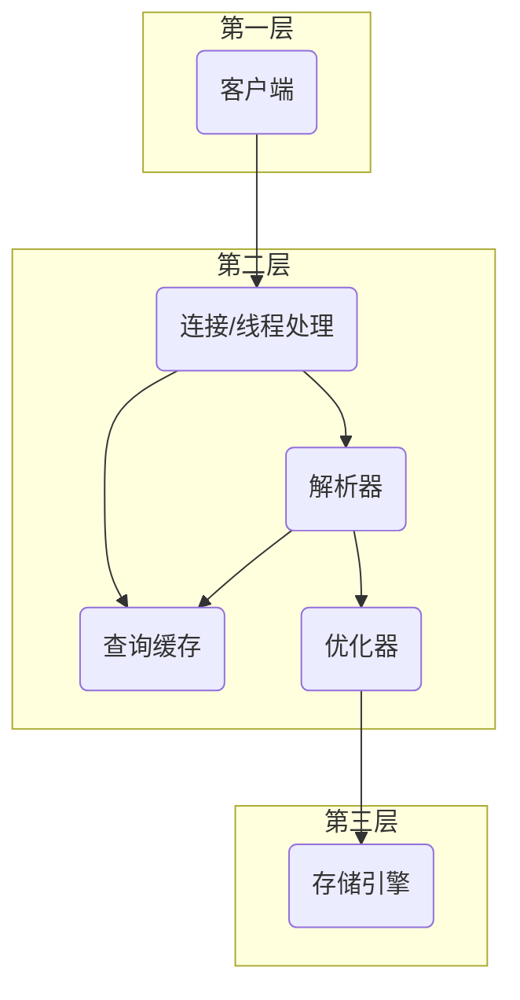

# 读《高性能MySQL》

[TOC]

*Mission Start!*

## MySQL逻辑结构



## 事务

### ACID
**原子性**：一个事务是一个不可分割的最小单元，整个事务的所有操作要么全部完成，要么全部不执行。    

**一致性**：数据库总是从一个一致性的状态转换到另外一个一致性的状态。    

**隔离性**：事务之间相互独立，一个事务在提交之前对其他事务是不可见的。    

**持久性**：一旦事务提交，其所作的修改将会永久保存到数据库中。    

### 隔离级别
**READ UNCOMMITTED（未提交读）**：在该级别中，事务的修改即使在没有提交的情况下，也会对其他事务可见。即，可以读取未提交的数据（脏读）。    

**READ COMMITTED（提交读）**：一个事务从开始到提交前，所做的任何操作对其他事务都是不可见的。但会出现不可重复读的问题，即，执行两次相同的查询，可能会得到不一样的结果。    

**REPEATABLE READ（可重复读）**：该级别保证了在同一事务中多次读取同样记录的结果是一致的。但该级别无法解决幻读问题，即，当某个事务在读取某一范围内的记录时，另一个事务又在该范围内插入新的记录，当之前的事务再次读取该范围的记录时，会产生幻行。    

**SERIALIZABLE（可串行化）**：强制事务串行执行，避免幻读问题。    

> 幻读和不可重复读的区别：
> 
> 不可重复读注重两次查询之间，数据发生了修改，例如，两次查询账户余额之间，另一事务修改了账户余额，从而导致两次相同查询的结果不同；
> 
> 而幻读注重两次相同的范围查询之间，插入了新的数据行，即出现了幻行。

### 死锁
InnoDB解决死锁的方法是，将持有最少行级排他锁的事务进行回滚。

### 事务日志
存储引擎在修改数据时，只需要修改其内存拷贝，然后将修改行为以追加的形式持久化到事务日志文件中，最后在后台将修改数据从内存中持久化到磁盘。    

事务日志可以提高事务的效率。

### MySQL的事务

① MySQL默认使用自动提交（AUTOCOMMIT），即，如果不是显式地开始事务，则每个查询都会当做一个事务执行提交操作。    

② 如果在事务中混用存储引擎，在回滚时会导致数据库处于不一致的状态，应避免这种情况的发生。    

③ MySQL支持LOCK TABLES和UNLOCK TABLES语句，其是在服务器层实现的，和存储引擎无关，不同于事务。避免显式地使用LOCK TABLES，除非事务中禁用了AUTOCOMMIT，否则会导致情况变得非常复杂。    

### 多版本并发控制（MVCC）

MVCC可以说是行级锁的变种，但它在很多情况下避免了加锁操作，因此开销更低。

**InnoDB的MVCC实现**：通过每行记录后保存两个隐藏的列来实现的。一列保存行的创建时间，另一列保存行的过期时间（这里的时间指系统版本号，而不是真实的时间值）.保存这两个额外的系统版本号，可以使大多数读操作都可以不用加锁，简化读数据操作，提高性能。

**在InnoDB中，MVCC只在READ COMMITTED（提交读）和REPEATABLE READ（可重复读）两个级别下工作，而READ UNCOMMITTED会读取最新的数据行，而不是当前版本的数据，SERIALIZABLE则会对所有读取的行都加锁。**

## 剖析MySQL查询

### 使用EXPLAIN

```sh
mysql> explain select * from test;
+----+-------------+-------+------------+------+---------------+------+---------+------+------+----------+-------+
| id | select_type | table | partitions | type | possible_keys | key  | key_len | ref  | rows | filtered | Extra |
+----+-------------+-------+------------+------+---------------+------+---------+------+------+----------+-------+
|  1 | SIMPLE      | test  | NULL       | ALL  | NULL          | NULL | NULL    | NULL |    1 |   100.00 | NULL  |
+----+-------------+-------+------------+------+---------------+------+---------+------+------+----------+-------+
```

> **select_type**: 查询的类型，simple表示简单查询，不包含子查询和union；primary表示包含union和子查询，且最外层部分被标志为primary；等等
> 
> **table**: 查询的表
> 
> **type**: 访问类型，是较为重要的一个指标，结果值从好到坏依次是：system > const > eq_ref > ref > fulltext > ref_or_null > index_merge > unique_subquery > index_subquery > range > index > ALL ，一般来说，得保证查询至少达到range级别，最好能达到ref。
> 
> **possible_keys**: 可能用到的索引，但是在实际优化过程中可能有些索引未被用到。
> 
> **key**: MySQL实际决定使用的键（索引）。
> 
> **key_len**: MySQL决定使用的键长度。
> 
> **ref**: 使用哪个列或常数与key一起从表中选择行。
> 
> **rows**: MySQL认为它执行查询时必须检查的行数（预估值）。
> 
> **Extra**: MySQL在查询过程中的一些详细信息，MySQL查询优化器执行查询的过程中对查询计划的重要补充信息。

### 慢查询日志

慢查询日志最初只是用来捕获比较慢的查询，但在MySQL 5.1及以后的版本中，**慢查询日志可以通过设置long_query_time为0来捕获所有的查询**，且响应时间单位已经可以做到微秒级。    

慢查询日志相关的一些值：
* slow_query_log: 是否打开慢查询日志
* slow_query_log_file: 慢查询日志文件
* long_query_time: 默认为10秒，大于该时间的会被记录到慢查询日志中

#### 查看慢查询日志状态

```sh
mysql> show variables like '%slow_query_log%';
+---------------------+--------------------------------------------+
| Variable_name       | Value                                      |
+---------------------+--------------------------------------------+
| slow_query_log      | OFF                                        |
| slow_query_log_file | /usr/local/mysql/data/Alan-Albert-slow.log |
+---------------------+--------------------------------------------+
```

```sh
# 查看long_query_time
mysql> show variables like '%long_query_time%';
+-----------------+-----------+
| Variable_name   | Value     |
+-----------------+-----------+
| long_query_time | 10.000000 |
+-----------------+-----------+
```

#### 打开或关闭慢查询日志

```sh
# 打开慢查询日志，关闭设为0
mysql> set global slow_query_log=1;
Query OK, 0 rows affected (0.01 sec)
```

使用该语句开启慢查询日志只对当前数据库生效，如果MySQL重启后则会生效。如果要永久开启，则需要修改配置文件my.cnf，如：

```ini
slow_query_log=1
# slow_query_log_file=/tmp/mysql_slow.log
```

### SHOW PROFILE命令

#### 查看SHOW PROFILE命令状态

```sh
mysql> show variables like '%profiling%';
+------------------------+-------+
| Variable_name          | Value |
+------------------------+-------+
| have_profiling         | YES   |
| profiling              | ON    |
| profiling_history_size | 15    |
+------------------------+-------+
```

#### 开启SHOW PROFILE命令
SHOW PROFILE命令默认是禁用的，开启方式：

```sh
mysql> set profiling = 1;
Query OK, 0 rows affected, 1 warning (0.00 sec)
```

#### 使用show profiles

**show profiles**: 显示最近发送到服务器上执行的语句的资源使用情况。显示的记录数由变量profiling_history_size控制。

```sh
mysql> show profiles;
+----------+------------+-----------------------------------+
| Query_ID | Duration   | Query                             |
+----------+------------+-----------------------------------+
|        1 | 0.00163200 | show variables like 'profiling'   |
+----------+------------+-----------------------------------+
```

#### 使用show profile

**show profile**: 展示最近一条语句执行的详细资源占用信息，默认显示 Status和Duration两列。

```sh
mysql> show profile;
+----------------------+----------+
| Status               | Duration |
+----------------------+----------+
| starting             | 0.000074 |
| checking permissions | 0.000037 |
| Opening tables       | 0.000026 |
| init                 | 0.000059 |
| System lock          | 0.000012 |
| optimizing           | 0.000007 |
| optimizing           | 0.000006 |
| statistics           | 0.000015 |
| preparing            | 0.000018 |
| statistics           | 0.000019 |
| preparing            | 0.000011 |
| executing            | 0.000011 |
| Sending data         | 0.000020 |
| executing            | 0.000005 |
| Sending data         | 0.001458 |
| end                  | 0.000009 |
| query end            | 0.000010 |
| removing tmp table   | 0.000021 |
| query end            | 0.000007 |
| closing tables       | 0.000012 |
| freeing items        | 0.000027 |
| logging slow query   | 0.001444 |
| cleaning up          | 0.000022 |
+----------------------+----------+
```

也可以根据show profiles的Query_ID，选择显示某条记录的性能信息。

```sh
mysql> show profile for query 1;
+----------------------+----------+
| Status               | Duration |
+----------------------+----------+
| starting             | 0.000062 |
| checking permissions | 0.000018 |
| Opening tables       | 0.000020 |
| init                 | 0.000084 |
| System lock          | 0.000009 |
| optimizing           | 0.000010 |
| optimizing           | 0.000004 |
| statistics           | 0.000012 |
| preparing            | 0.000015 |
| statistics           | 0.000015 |
| preparing            | 0.000008 |
| executing            | 0.000009 |
| Sending data         | 0.000008 |
| executing            | 0.000004 |
| Sending data         | 0.001124 |
| end                  | 0.000008 |
| query end            | 0.000014 |
| removing tmp table   | 0.000018 |
| query end            | 0.000006 |
| closing tables       | 0.000011 |
| freeing items        | 0.000032 |
| logging slow query   | 0.000117 |
| cleaning up          | 0.000024 |
+----------------------+----------+
```

也可以指定消耗的资源查询：

```sh
mysql> show profile cpu for query 1;
+----------------------+----------+----------+------------+
| Status               | Duration | CPU_user | CPU_system |
+----------------------+----------+----------+------------+
| starting             | 0.000062 | 0.000056 |   0.000006 |
| checking permissions | 0.000018 | 0.000015 |   0.000003 |
| Opening tables       | 0.000020 | 0.000019 |   0.000002 |
| init                 | 0.000084 | 0.000056 |   0.000027 |
| System lock          | 0.000009 | 0.000008 |   0.000005 |
| optimizing           | 0.000010 | 0.000004 |   0.000002 |
| optimizing           | 0.000004 | 0.000003 |   0.000001 |
| statistics           | 0.000012 | 0.000011 |   0.000001 |
| preparing            | 0.000015 | 0.000013 |   0.000002 |
| statistics           | 0.000015 | 0.000013 |   0.000001 |
| preparing            | 0.000008 | 0.000007 |   0.000002 |
| executing            | 0.000009 | 0.000007 |   0.000002 |
| Sending data         | 0.000008 | 0.000007 |   0.000001 |
| executing            | 0.000004 | 0.000002 |   0.000001 |
| Sending data         | 0.001124 | 0.001109 |   0.000016 |
| end                  | 0.000008 | 0.000006 |   0.000007 |
| query end            | 0.000014 | 0.000008 |   0.000001 |
| removing tmp table   | 0.000018 | 0.000016 |   0.000002 |
| query end            | 0.000006 | 0.000003 |   0.000002 |
| closing tables       | 0.000011 | 0.000011 |   0.000002 |
| freeing items        | 0.000032 | 0.000015 |   0.000016 |
| logging slow query   | 0.000117 | 0.000032 |   0.000086 |
| cleaning up          | 0.000024 | 0.000021 |   0.000003 |
+----------------------+----------+----------+------------+
```

### 使用SHOW STATUS

MySQL的SHOW STATUS命令会返回一些计数器。可以使用该命令查看该语句使用了多少个临时表、是否用到索引的读操作等。

```sh
mysql> flush status;
mysql> select * from test;
mysql> show status;  
```

**需要注意的是**：使用show status本身也会创建一个临时表，而且也会通过句柄操作访问此临时表，这也会影响到输出的结果。

### SHOW PROCESSLIST

该命令用于查看线程，观察是否有大量线程处于不正常状态或者有其他不正常的特征。

```sh
mysql> show processlist;
+----+-----------------+-----------+-------+---------+-------+------------------------+------------------+
| Id | User            | Host      | db    | Command | Time  | State                  | Info             |
+----+-----------------+-----------+-------+---------+-------+------------------------+------------------+
|  4 | event_scheduler | localhost | NULL  | Daemon  | 23210 | Waiting on empty queue | NULL             |
| 13 | root            | localhost | test2 | Query   |     0 | starting               | show processlist |
+----+-----------------+-----------+-------+---------+-------+------------------------+------------------+
```

## 表与数据类型的优化

### 选择数据类型的原则

> **更小的通常更好**：尽量使用可以正确存储数据的最小数据类型。因为更小通常更快，性能更好。
> 
> **简单就好**：简单数据类型通常需要更少的CPU周期。例，使用MySQL内建的类型而不是字符串来存储日期和时间；应该用整型存储IP地址，因为IP本身就是一串数字，使用点分割只是为了更容易让我们识别。
> 
> **尽量避免NULL**：使用NULL会让MySQL更难优化，因为可为NULL的列使得索引、索引统计和值更复杂。

### 整数

TINYINT, SMALLINT, MEDIUMINT, INT, BIGINT。分别使用8, 16, 24, 32, 64位存储空间。   

MySQL可以为整数类型指定宽度，但是不会限制值的合法范围，只是规定一些MySQL交互工具用来显示字符的个数。

### 实数

FLOAT, DOUBLE, DECIMAL。FLOAT使用4个字节，DOUBLE使用8个字节。    

其中FLOAT、DOUBLE使用浮点运算实现，而DECIMAL是由MySQL服务器实现其计算。

```sql
decimal(总位数, 小数点后位数)
```

### 字符串

VARCHAR, CHAR。VARCHAR为变长，CHAR为定长。当使用VARCHAR时，ROW_FORMAT不应该指定为FIXED，因为FIXED表示行长度不可变。

### 枚举

ENUM。底层使用整数存储，存在“数字-字符串”的映射关系表。**需要注意的是排序时是按照内部整数进行排序，而不是按照字符串**。在定义时，可以将枚举的项按字符串排好序，已解决排序问题。

### 时间

DATETIME: 1001~9999，占8个字节，与时区无关。   

TIMESTAMP: 1970~2038，占4个字节，与时区有关。在插入数据时，若未指定值，则自动取当前时间作为值填充。

### MySQL设计中应避免的问题

> ① 使用太多的列；
> 
> ② 使用太多的关联：如果希望查询执行得快速且并发性好，单个查询最好在12个表内做关联。
> 
> ③ 过度使用枚举；
> 
> ④ 完全不使用NULL，有时候使用NULL能更好的处理业务逻辑。

### 范式

**范式的优点**：范式化的更新操作通常比反范式化要快；范式化的表更小，执行操作会更快；冗余数据更少，查询数据时更少使用DISTINCT或GROUP BY。   

**范式的缺点**：范式化的表需要关联操作。    

在实际使用中，通常**混合使用范式化和反范式化**。

### ALTER TABLE操作

当对表使用ALTER TABLE操作时，大部分时候会导致MySQL服务中断。常用的解决方法有：

> ① 先在一台不提供服务的机器上执行ALTER TABLE操作，然后和提供服务的主库进行切换。
> 
> ② 影子拷贝：用要求的表结构创建一张和源表无关的新表，然后通过重命名和删表操作交换两张表。


## 创建高性能的索引

### B-Tree索引

B-Tree索引是最通用的索引类型。B-Tree索引适用于全键值、键值范围、键前缀查找、ORDER BY。

### Hash索引

哈希索引，对所有索引列计算一个哈希码，并将哈希码存储在索引中，同时在哈希表中保存指向数据行的指针。哈希冲突时，使用链表保存相同哈希码的数据。    

Hash索引的特点：

> ① 只有精确匹配索引的每一列才有效，因为Hash索引需要使用所有列计算出hash码才能找到对应的数据行。
> 
> ② 无法用于排序；
> 
> ③ 速度快；
> 
> ④ 只能用于等值查询，不能用于范围查询。

### 模拟Hash索引

例如：存储大量URL时，需要根据URL进行搜索查找。这时，可以添加一个被索引的url_crc列，使用CRC32作为hash。

```sql
select id from url where url_crc=CRC32("http://") and url="http://"
```

### 全文索引

全文索引是一种特殊类型的索引，它查找的是文本中的关键词，而不是直接比较索引中的值。

### 高性能的索引策略

> ① 索引列不能是表达式的一部分，也不能是函数的参数。应该养成简化WHERE条件的习惯，始终将索引列单独放在比较符号的一侧。
> 
> ② 当需要索引很长的字符列时，可以索引开始的部分前缀字符，以节约索引空间。
> 
> ③ 当创建多列索引时，需要注意索引列的顺序，应遵循前缀原则进行排序。

### 聚簇索引

聚簇索引不同于B-Tree索引、Hash索引，其不是一种索引类型，而是一种数据存储方式。   

InnoDB的聚簇索引在同一个结构中保存了B-Tree索引和数据行。InnoDB通过主键聚集数据，如果没有定义主键，InnoDB会选择一个唯一的非空索引代替，如果没有这样的索引，InnoDB会隐式定义一个主键来作为聚簇索引。

> 聚簇索引的优点：① 可以把相关数据保存在一起；② 数据访问更快；③ 使用覆盖索引扫描的查询可以直接使用叶节点中的主键值。
> 
> 聚簇索引的缺点：① 插入速度严重依赖于插入顺序；② 更新聚簇索引列的代价很高；③ 聚簇索引可能导致全盘扫描变慢。

*Todo*

*Mission Complete!*